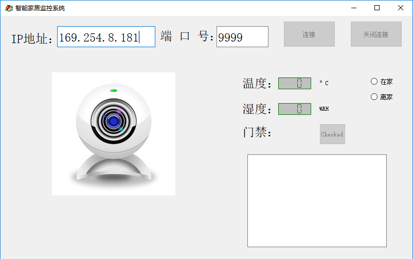

# RQ_HMS
## 基于树莓派3B+和QT的一个智能家居监控系统

* /Linux 目录存放服务器（树莓派）的代码
* /QT 目录存放客户端（PC）的代码

## 物理连接

* 树莓派 GPIO_1 连接 DHT11（使用 WiringPi库）
* 树莓派 GPIO_4 连接 红外
* 树莓派 GPIO_5 连接 蜂鸣器
* 树莓派 USB2.0 连接 摄像头
* 客户端 通过网线或无线连接树莓派（服务器端）

## 已完成

* 火灾报警、拜访提示音、闯入报警
* 读取dht11
* 温湿度值校验
* 多连接支持，pthread & mutex
* QT基本界面
* 视频
* 日志

## QT界面

## 结语
* 本项目实现了家庭监控系统的基本功能，包括温湿度显示、视频显示、有人提醒、火灾报警、日志功能，但是由于项目初期对于系统目标以及功能设计的不完整，暂停开发。

## 可完善

* 视频优化
* 用户登录
* 日志升级（双向传输 & 数据库）
* 常用IP下拉栏 + IP输入格式限制
* 录制视频 + 回看功能
* 短信 + 设置主机号码
* UI美化

## 可升级

* 红外传感器受环境光影响，可替换为微波感应开关
* USB摄像头换为专业摄像头，使采集点变多，且传输距离更远
* 升级报警器
* app客户端

# RQ_HMS
## Made a home monitoring system with Raspberry Pi and QT.

* /linux stores the code on the Raspberry Pi.
* /QT shores the QT code.

## Raspberry Pi physical connection:

* DTH11 sensor monitor temperature and humidity,Connected to WiringPi_GPIO_1
* Infrared sensor monitor pass and into,Connected to WiringPi_GPIO_4
* The buzzer is used for alarm,Connected to WiringPi_GPIO_5
* Camera connected to USB.

## Conclusion

* This project implements the basic functions of the home monitoring system,include temperature and humidity display function、video display、reminder、fire alarm、log function.
* However,due to the initial design of the system for the system goals and functional design is not completed, suspended development.